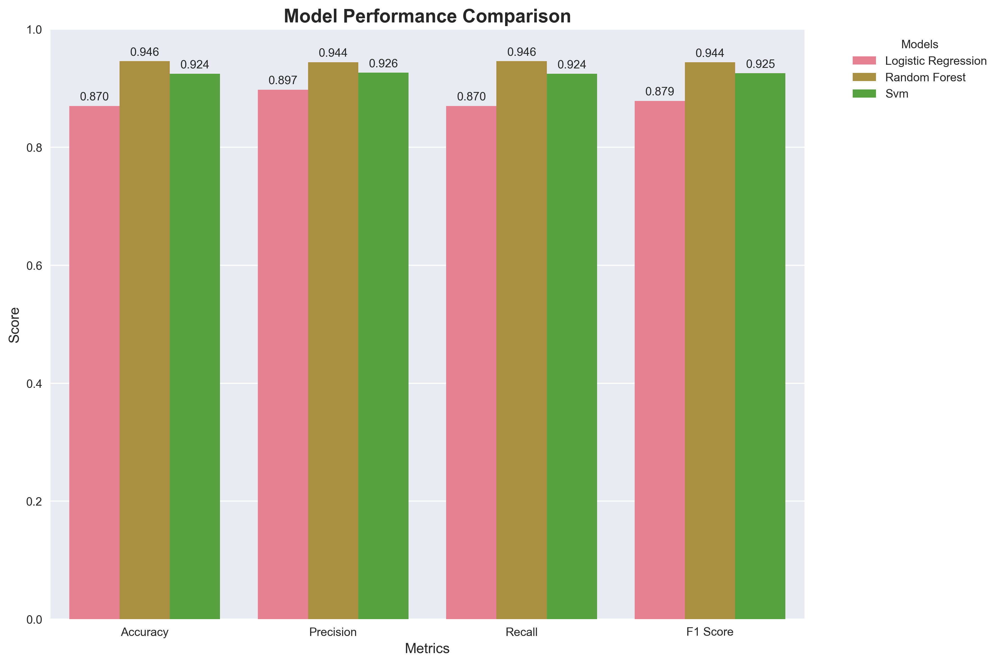
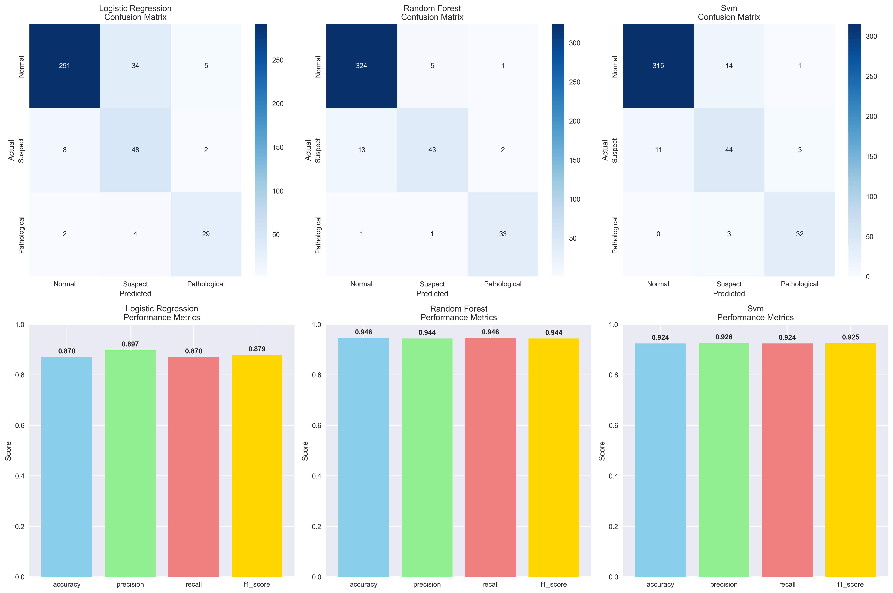
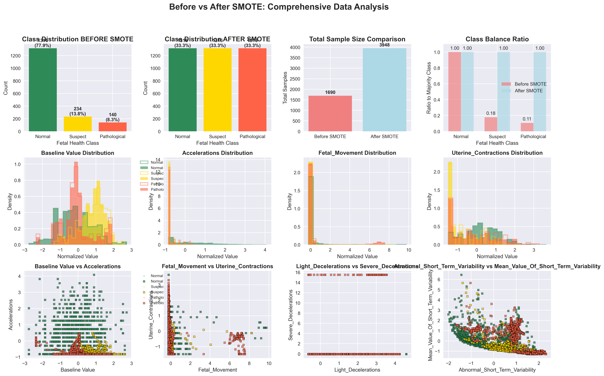
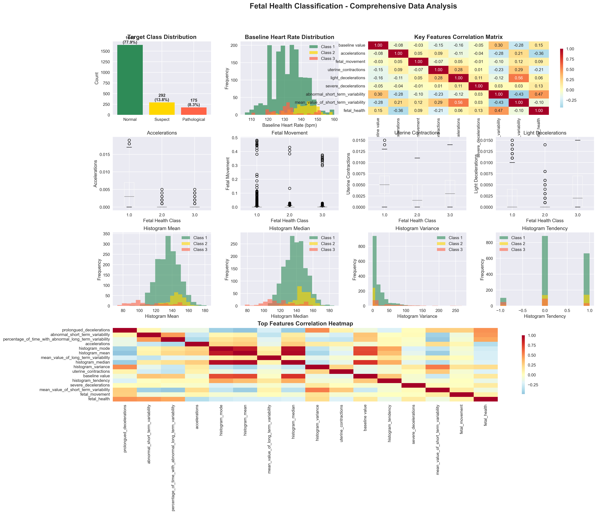
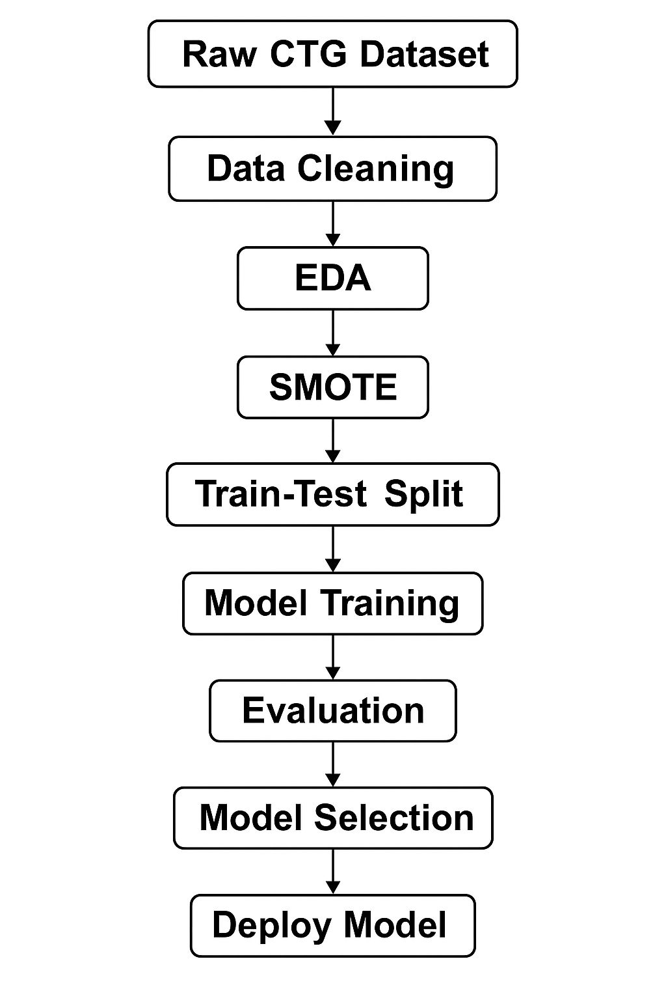

# 🩺 Fetal Health Classification using Machine Learning


---<h1 align="center">Fetal Health Classification (CTG)</h1>

<p align="center">
  Classifies cardiotocography readings into Normal / Suspect / Pathological with scikit-learn, handling the heavy class imbalance with SMOTE applied the right way — inside the training pipeline, never leaking into the test set. Random Forest reaches 94.6% accuracy on the held-out real-distribution test set.
</p>

<p align="center">
  
  
  
  
</p>

<p align="center">
  <a href="Fetal_health_classification.pdf">Report (PDF)</a> ·
  <a href="#results">Results</a> ·
  <a href="#quickstart">Quickstart</a> ·
  <a href="#method">Method</a> ·
  <a href="#cite">Cite</a>
</p>

<p align="center">
  
</p>
<p align="center"><em>Three models compared on the held-out test set; Random Forest leads on every metric.</em></p>

> [!WARNING]
> This is an academic / educational project, not a medical device. It is not validated for clinical use, and nothing here should drive a real diagnosis or treatment decision. CTG interpretation belongs to qualified clinicians.

## Overview

Cardiotocography (CTG) records fetal heart rate and uterine contractions during pregnancy. Clinicians read those traces to flag distress, but the readings are high-dimensional and the interesting cases are rare, which makes consistent triage hard. This project treats it as a supervised classification problem: given 21 numeric CTG features, predict whether a reading is Normal, Suspect, or Pathological.

The dataset is badly imbalanced — most readings are Normal, and the Pathological class is the one you least want to miss. The core of the project is handling that imbalance honestly and comparing three standard classifiers on the result. The full write-up is in the [report](Fetal_health_classification.pdf).

## Results

Metrics below are read from the committed `outputs/analysis_report.txt`, measured on a 20% held-out test set that keeps the **original class distribution** (no synthetic samples in the test set):

| Model | Accuracy | Precision | Recall | F1 |
|---|---|---|---|---|
| Logistic Regression | 0.870 | 0.897 | 0.870 | 0.879 |
| **Random Forest** | **0.946** | **0.944** | **0.946** | **0.944** |
| SVM | 0.924 | 0.926 | 0.924 | 0.925 |

Random Forest wins across the board. Its per-class behaviour on the test set (from the confusion matrix):

| Actual \ Predicted | Normal | Suspect | Pathological |
|---|---|---|---|
| **Normal** | 324 | 5 | 1 |
| **Suspect** | 13 | 43 | 2 |
| **Pathological** | 1 | 1 | 33 |

Normal is caught 98% of the time and Pathological 94% (33/35). The weak spot is honest and worth stating: **Suspect recall is only ~74%** (43/58) — the borderline class is the hardest to separate, and most of its errors fall into Normal. For a triage tool that's the error you'd want to drive down next.

<p align="center">
  
</p>

The features Random Forest leans on most (importances from the same report): abnormal short-term variability (0.144), percentage of time with abnormal long-term variability (0.119), histogram mean (0.100), histogram median (0.079), and mean short-term variability (0.077). Variability metrics dominate, which lines up with how clinicians read CTG traces.

## Method

The pipeline that makes the numbers trustworthy:

1. **Load & de-duplicate** — the raw CSV has 2,126 CTG records; dropping exact duplicates leaves 2,113 (Normal 1,646 / Suspect 292 / Pathological 175).
2. **Split first** — an 80/20 stratified train/test split *before* any resampling.
3. **SMOTE inside the pipeline** — SMOTE and the `StandardScaler` are steps in an `imblearn.Pipeline`, so they're fit on training folds only. The test set is never oversampled or scaled with test statistics.
4. **Train & compare** — Logistic Regression, Random Forest, SVM, each in its own pipeline.
5. **Evaluate on the real distribution** — accuracy, precision, recall, F1, and a confusion matrix on the untouched test set.

> [!NOTE]
> Applying SMOTE *before* the split is a common and silent mistake that inflates accuracy by leaking synthetic neighbours of test points into training. This project avoids it by keeping SMOTE inside the fitted pipeline — the reported numbers are measured on genuinely unseen, real-distribution data.

<p align="center">
  
</p>
<p align="center"><em>SMOTE balances the three classes in the training data (each to 1,316 samples); the test set is left untouched.</em></p>

## Quickstart

```bash
git clone https://github.com/thelostbong/Fetal_Health_Classification_using_Machine_Learning.git
cd Fetal_Health_Classification_using_Machine_Learning

pip install -r requirements.txt
python fetal_health_prediction.py
```

The script runs the full pipeline — EDA, SMOTE, training all three models, evaluation, plots into `outputs/`, and serialized models into `models/`.

Using the trained model directly:

```python
import joblib
model = joblib.load("models/random_forest_model.joblib")
predictions = model.predict(X_new)   # X_new: 21 CTG features, same order as training
```

## Repository structure

```
.
├── fetal_health_prediction.py       # full ML pipeline (EDA → SMOTE → train → eval → report)
├── requirements.txt
├── data/
│   └── fetal_health.csv             # CTG dataset (2,126 records, 21 features, 3 classes)
├── models/                          # serialized LR / RF / SVM (.joblib)
├── outputs/                         # plots, analysis_report.txt, auto-generated PDF
└── Fetal_health_classification.pdf  # project report
```

## Roadmap

- **Raise Suspect recall** — the 74% on the borderline class is the main weakness; cost-sensitive learning or a tuned decision threshold would help more than a fancier model.
- **Hyperparameter search** — GridSearch/RandomizedSearch with stratified k-fold instead of the current fixed settings.
- **Gradient boosting** — XGBoost / LightGBM / CatBoost as stronger tabular baselines.
- **Calibration** — probability calibration matters more than raw accuracy for a triage aid.

## Cite

```bibtex
@techreport{mohammed2025fetalhealth,
  title  = {Fetal Health Classification using Machine Learning},
  author = {Mohammed, Nayeemuddin},
  year   = {2025},
  institution = {Deggendorf Institute of Technology},
  note   = {https://github.com/thelostbong/Fetal_Health_Classification_using_Machine_Learning}
}
```

## License · Acknowledgements · Contact

MIT License — see [LICENSE](LICENSE). Dataset: the UCI/Kaggle Fetal Health Classification set derived from SisPorto CTG analysis (Ayres-de-Campos et al., 2000). SMOTE: Chawla et al. (2002).

**Nayeemuddin Mohammed** — M.Sc. Applied AI for Digital Production Management, THD
[GitHub](https://github.com/thelostbong) · [LinkedIn](https://linkedin.com/in/nayeemuddin-mohammed-03/) · nayeemuddin.mohammed@th-deg.de

## 📋 Overview

This project implements a **machine learning-based classification system** to predict fetal health status using Cardiotocography (CTG) data. CTG is a continuous recording of fetal heart rate and uterine contractions, commonly used during pregnancy to monitor fetal well-being.

The system classifies fetal health into three categories:
- **Normal**: Healthy fetal condition
- **Suspect**: Requires further monitoring
- **Pathological**: Requires immediate medical intervention

By leveraging advanced machine learning algorithms and addressing class imbalance through SMOTE (Synthetic Minority Over-sampling Technique), the project achieves **94.6% accuracy** using Random Forest, making it a reliable tool for assisting healthcare professionals in early detection of fetal distress.

---

## ✨ Key Features

- **Comprehensive Exploratory Data Analysis (EDA)**: Statistical analysis, correlation matrices, and feature distributions across fetal health classes
- **Class Imbalance Handling**: Implementation of SMOTE to balance the highly imbalanced dataset (77.9% vs 13.8% vs 8.3%)
- **Multi-Model Comparison**: Training and evaluation of three classification algorithms (Logistic Regression, Random Forest, SVM)
- **High Accuracy**: Achieves 94.6% accuracy with Random Forest classifier
- **Feature Importance Analysis**: Identification of the most critical CTG features for fetal health prediction
- **Automated Reporting**: Generates comprehensive PDF reports with visualizations and performance metrics
- **Production-Ready Models**: Serialized models saved using joblib for easy deployment

---

## 🛠️ Technologies Used

### **Core Libraries**
- **Python 3.8+** - Programming language
- **pandas** - Data manipulation and analysis
- **numpy** - Numerical computing

### **Machine Learning**
- **scikit-learn** - Model training, evaluation, and preprocessing
  - `LogisticRegression`
  - `RandomForestClassifier`
  - `SVC` (Support Vector Classifier)
- **imbalanced-learn (imblearn)** - SMOTE implementation for class balancing
- **joblib** - Model serialization

### **Data Visualization**
- **matplotlib** - Plotting and visualization
- **seaborn** - Statistical data visualization

### **Reporting**
- **FPDF / ReportLab** - PDF report generation

---

## 📁 Folder Structure

```
fetal_health_prediction/
│
├── fetal_health_prediction.py          # Main script with complete ML pipeline
│
├── data/
│   └── fetal_health.csv                # CTG dataset (2,113 samples, 21 features)
│
├── models/
│   ├── logistic_regression_model.joblib  # Trained Logistic Regression model
│   ├── random_forest_model.joblib        # Trained Random Forest model (Best: 94.6% accuracy)
│   └── svm_model.joblib                  # Trained SVM model
│
├── outputs/
│   ├── before_after_smote_analysis.png      # SMOTE impact visualization
│   ├── comprehensive_data_analysis.png      # EDA results and distributions
│   ├── model_comparison.png                 # Performance comparison across models
│   ├── model_evaluation.png                 # Confusion matrices and metrics
│   ├── flowchart.jpg                        # Project workflow diagram
│   └── fetal_health_analysis_report.pdf    # Comprehensive analysis report
│
└── README.md                            # Project documentation
```

---

## 🚀 Getting Started

### **Prerequisites**

Ensure you have the following installed:
- **Python 3.8 or higher**
- **pip** (Python package manager)

### **Installation**

1. **Clone the repository:**
   ```bash
   git clone https://github.com/yourusername/fetal-health-classification.git
   cd fetal-health-classification
   ```

2. **Install required dependencies:**
   ```bash
   pip install pandas numpy scikit-learn imbalanced-learn matplotlib seaborn joblib fpdf
   ```

   Or create a `requirements.txt` file:
   ```txt
   pandas>=1.3.0
   numpy>=1.21.0
   scikit-learn>=1.0.0
   imbalanced-learn>=0.9.0
   matplotlib>=3.4.0
   seaborn>=0.11.0
   joblib>=1.1.0
   fpdf>=1.7.2
   ```

   Then install:
   ```bash
   pip install -r requirements.txt
   ```

3. **Verify dataset availability:**
   Ensure the `fetal_health.csv` file is present in the `data/` directory.

---

## 💻 Usage

Run the main script to execute the complete machine learning pipeline:

```bash
python fetal_health_prediction.py
```

### **What the script does:**

1. **Loads and preprocesses** the CTG dataset
2. **Performs exploratory data analysis** (EDA) with visualizations
3. **Applies SMOTE** to balance class distribution
4. **Trains three classification models**:
   - Logistic Regression
   - Random Forest
   - Support Vector Machine (SVM)
5. **Evaluates models** using accuracy, precision, recall, and F1-score
6. **Generates confusion matrices** for each model
7. **Saves trained models** in the `models/` directory
8. **Creates visualizations** and exports them to `outputs/`
9. **Generates a comprehensive PDF report**

### **Loading a Pre-trained Model:**

```python
import joblib

# Load the best performing model (Random Forest)
model = joblib.load('models/random_forest_model.joblib')

# Make predictions on new data
predictions = model.predict(X_new)
```

---

## 📊 Results

### **Dataset Statistics**
- **Total Samples**: 2,113 CTG recordings
- **Number of Features**: 21 physiological measurements
- **Missing Values**: 0 (clean dataset)

### **Class Distribution (Before SMOTE)**
| Class | Count | Percentage |
|-------|-------|------------|
| Normal | 1,646 | 77.9% |
| Suspect | 292 | 13.8% |
| Pathological | 175 | 8.3% |


*The dataset exhibited severe class imbalance, which was addressed using SMOTE to create a balanced dataset with 1,316 samples per class (3,948 total samples).*

---

### **Exploratory Data Analysis (EDA)**



**Key Insights:**
- **Baseline Heart Rate**: Normal fetuses show heart rates concentrated around 130-140 bpm
- **Accelerations**: Inversely correlated with fetal health issues (correlation: -0.36)
- **Short-Term Variability**: Strong positive correlation with pathological cases (correlation: 0.47)
- **Feature Correlations**: Histogram features (mean, median, variance) show strong inter-correlation, indicating shared underlying patterns

---

### **Model Performance Comparison**


| Model | Accuracy | Precision | Recall | F1-Score |
|-------|----------|-----------|--------|----------|
| **Logistic Regression** | 87.0% | 89.7% | 87.0% | 87.9% |
| **Random Forest** ⭐ | **94.6%** | **94.4%** | **94.6%** | **94.4%** |
| **SVM** | 92.4% | 92.6% | 92.4% | 92.5% |

**Winner**: **Random Forest** consistently outperforms other models across all metrics, achieving the highest accuracy and F1-score.

---

### **Confusion Matrices**


#### **Random Forest Confusion Matrix (Best Model)**
|               | Predicted Normal | Predicted Suspect | Predicted Pathological |
|---------------|------------------|-------------------|------------------------|
| **Actual Normal** | 324 | 5 | 1 |
| **Actual Suspect** | 13 | 43 | 2 |
| **Actual Pathological** | 1 | 1 | 33 |

- **Normal Class**: 98.2% correctly identified (324/330)
- **Suspect Class**: 74.1% correctly identified (43/58)
- **Pathological Class**: 94.3% correctly identified (33/35)

---

### **Top 15 Most Important Features (Random Forest)**

1. **Abnormal Short Term Variability** (14.4%)
2. **Percentage of Time with Abnormal Long Term Variability** (11.9%)
3. **Histogram Mean** (10.0%)
4. **Histogram Median** (7.9%)
5. **Mean Value of Short Term Variability** (7.7%)
6. **Accelerations** (7.3%)
7. **Histogram Mode** (6.1%)
8. **Prolonged Decelerations** (5.4%)
9. **Mean Value of Long Term Variability** (5.3%)
10. **Baseline Value** (4.7%)
11. **Histogram Variance** (3.9%)
12. **Histogram Width** (2.7%)
13. **Histogram Max** (2.5%)
14. **Uterine Contractions** (2.3%)
15. **Histogram Min** (2.1%)

*These features collectively account for the model's decision-making process, with short-term and long-term variability metrics being the most critical indicators of fetal health.*

---

### **SMOTE Impact Analysis**


**Before SMOTE:**
- Total samples: 1,690
- Class imbalance ratio: 1.00 : 0.18 : 0.11

**After SMOTE:**
- Total samples: 3,948
- Class balance ratio: 1.00 : 1.00 : 1.00
- Each class: 1,316 samples (perfect balance)

SMOTE successfully generated synthetic samples for minority classes while preserving the statistical properties and feature distributions of the original data, leading to improved model performance, especially for the Suspect and Pathological classes.

---

### **Project Workflow**



The complete machine learning pipeline consists of:
1. **Raw CTG Dataset** ingestion
2. **Data Cleaning** and preprocessing
3. **Exploratory Data Analysis (EDA)**
4. **SMOTE** application for class balancing
5. **Train-Test Split** (80/20 ratio)
6. **Model Training** (3 algorithms)
7. **Evaluation** with comprehensive metrics
8. **Model Selection** (Random Forest identified as best)
9. **Deployment-Ready Model** saved for production use

---

## 🔮 Future Improvements

Based on the current implementation and analysis, here are potential enhancements:

1. **Deep Learning Integration**
   - Implement Convolutional Neural Networks (CNN) or Recurrent Neural Networks (RNN) to capture temporal patterns in CTG time-series data
   - Explore ensemble methods combining traditional ML with deep learning for improved accuracy
   - Potential to achieve >96% accuracy with properly tuned neural networks

2. **Real-Time Monitoring System**
   - Develop a web-based dashboard (using Flask/Django) for real-time fetal health monitoring
   - Integrate with IoT-enabled CTG devices for continuous data streaming
   - Implement alert systems that notify healthcare professionals when pathological patterns are detected

3. **Hyperparameter Optimization & Model Tuning**
   - Apply GridSearchCV or RandomizedSearchCV for exhaustive hyperparameter tuning
   - Implement Bayesian Optimization or Genetic Algorithms for optimal parameter selection
   - Explore XGBoost, LightGBM, and CatBoost as alternative ensemble methods
   - Cross-validation strategies (k-fold, stratified k-fold) for more robust evaluation

---

## 📄 License

This project is licensed under the **MIT License** - see the LICENSE file for details.

---

## 🤝 Contributing

Contributions are welcome! If you'd like to improve this project:

1. Fork the repository
2. Create a feature branch (`git checkout -b feature/AmazingFeature`)
3. Commit your changes (`git commit -m 'Add some AmazingFeature'`)
4. Push to the branch (`git push origin feature/AmazingFeature`)
5. Open a Pull Request

---

## 👨‍💻 Author

**Nayeemuddin Mohammed**
- GitHub: [@thelostbong](https://github.com/thelostbong)
- LinkedIn: [nayeemuddin-mohammed-03](https://linkedin.com/in/nayeemuddin-mohammed-03/)

---

## 🙏 Acknowledgments

- **UCI Machine Learning Repository** - For providing the Fetal Health Classification dataset
- **scikit-learn Documentation** - For comprehensive ML algorithm references
- **imbalanced-learn Library** - For SMOTE implementation
- **Healthcare Community** - For domain expertise in CTG interpretation

---

## 📚 References

1. Ayres-de-Campos, D., et al. (2000). *SisPorto 2.0: A program for automated analysis of cardiotocograms*. Journal of Maternal-Fetal Medicine.
2. Chawla, N. V., et al. (2002). *SMOTE: Synthetic Minority Over-sampling Technique*. Journal of Artificial Intelligence Research.
3. Breiman, L. (2001). *Random Forests*. Machine Learning, 45(1), 5-32.

---

<div align="center">
  <strong>⭐ If you found this project helpful, please consider giving it a star! ⭐</strong>
</div>
